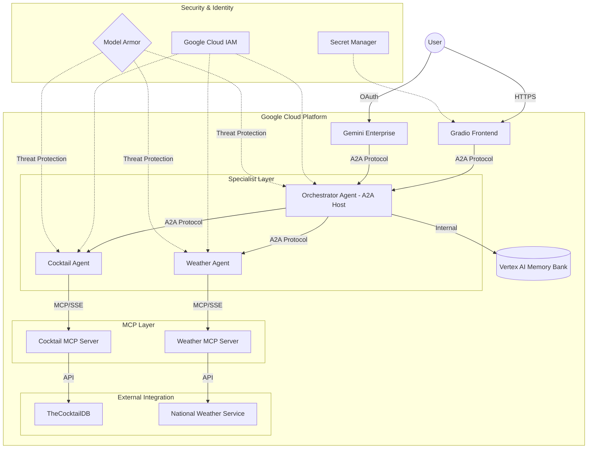
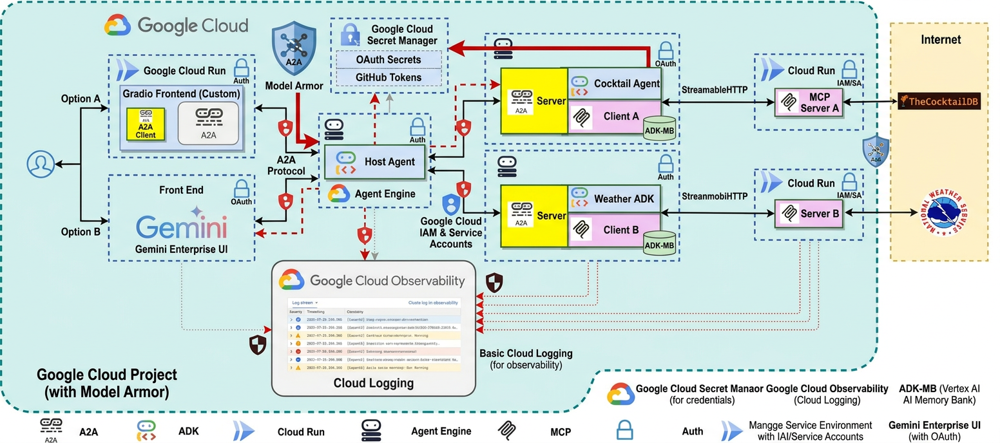
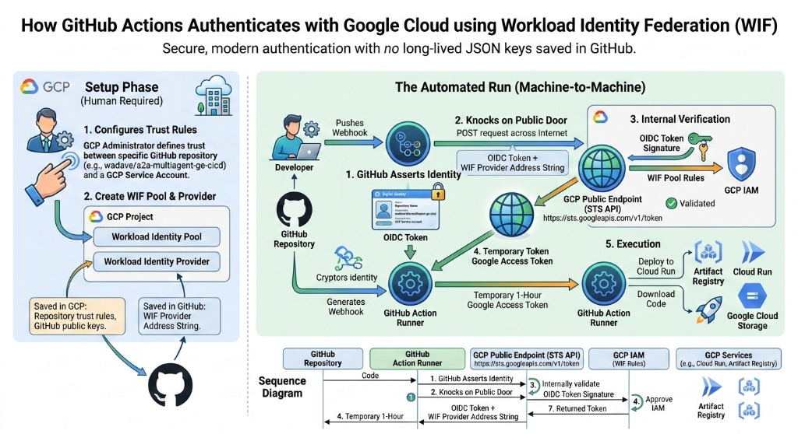

# A2A Multi-Agent with Memory Bank (adk-mb)

This document describes a multi-agent setup using Agent2Agent (A2A), ADK (Agent Development Kit), Agent Engine, MCP (Model Context Protocol) servers, and **Vertex AI Memory Bank** for conversation persistence. The application demonstrates how the A2A protocol works between agents with memory capabilities.

## Overview

This web application demonstrates the integration of Google's open-source frameworks Agent2Agent (A2A) and Agent Development Kit (ADK) for multi-agent orchestration with Model Context Protocol (MCP) clients. The application features a host agent coordinating tasks between specialized remote A2A agents that interact with various MCP servers to fulfill user requests.

### Key Features

- **Multi-Agent Orchestration**: Host agent delegates tasks to specialized agents (Cocktail, Weather)
- **Memory Bank Integration**: Conversation history persisted using Vertex AI Memory Bank (the "mb" in "adk-mb")
- **MCP Protocol**: Agents communicate with remote MCP servers for data retrieval
- **A2A Protocol**: Standardized agent-to-agent communication
- **Cloud Logging**: Integrated Google Cloud Logging for unified observability across all agents
- **CI/CD Pipeline**: Automated deployment using GitHub Actions and Terraform
- **Performance Optimization**: Shared HTTP client pooling and metadata caching for reduced latency
- **Resiliency**: Custom Circuit Breaker for robust external communication
- **Threat Protection**: Google Cloud Model Armor integration for Vertex AI LLM calls

### Architecture

The application demonstrates a multi-agent orchestration pattern using Google's **Agent2Agent (A2A)** and **Agent Development Kit (ADK)** frameworks. This architecture enables secure, modular communication between a central host and specialized remote agents.





#### 1. Entry Point: Frontend
The system supports two parallel entry point options for user interaction:
- **Option A: Customized Frontend**: A **Gradio** web interface hosted on **Google Cloud Run**. This acts as an explicit A2A client that communicates securely with the orchestrator.
- **Option B: Gemini Enterprise UI**: Direct interaction via the **Gemini Enterprise UI**, utilizing standard **OAuth** for secure authentication and access.

#### 2. Orchestration: Host Agent
The **Host Agent** serves as the central "brain" within a Vertex AI **Agent Engine** environment.
- **Routing**: Analyzes user queries and delegates tasks to specialized downstream agents using the A2A protocol.
- **Context Persistence**: Integrates with **Vertex AI Memory Bank** to maintain conversation history and semantic context across user sessions.

#### 3. Specialists: Cocktail & Weather Agents
Specialized **Remote A2A Agents** handle domain-specific queries in isolated environments:
- **Cocktail Agent**: Manages recipes, ingredients, and mixology data.
- **Weather Agent**: Handles meteorological forecasts and alerts.
Each agent leverages **ADK** for internal logic and an **MCP Client** for external data retrieval.

#### 4. Data Retrieval: MCP Servers
Agents retrieve real-time information through **Model Context Protocol (MCP)** servers acting as standardized adapters:
- **Standardized Tools**: MCP servers translate agent requests into specific API calls.
- **External Sources**: Pulls data from sources like TheCocktailDB and the National Weather Service.

**The Host Agent is built using A2A Server with built-in Memory Bank integration.**

## Security

The application implements a multi-layered, **Zero-Trust** security strategy:

- **Identity-Based Auth**: Utilizes **Google Cloud IAM** and **Service Accounts** for all internal service-to-service communication.
- **Model Armor**: Enforces project-wide floor settings automatically to inspect and block malicious or inappropriate prompts and LLM responses at the Vertex AI API layer (`INSPECT_AND_BLOCK`).
- **Automatic Token Management**: Agents use a `TokenManager` to dynamically fetch and refresh Google OIDC tokens for MCP server authentication, avoiding any hardcoded Bearer tokens.
- **Gemini Enterprise UI**: Utilizes **OAuth** for secure user authentication and access control.
- **Credential Management**: Sensitive credentials, such as Github tokens and OAuth secrets, are stored and managed using **Google Cloud Secret Manager**.
- **Secure History**: The Git history is sanitized to ensure no sensitive tokens or endpoints are exposed in previous commits.

## Observability

The application uses **Google Cloud Logging** to provide structured, centralized logging across all agents and the frontend.

- **Centralized Logs**: All agents (Host, Cocktail, Weather) send logs to a single location in Google Cloud.
- **Agent-Specific Logs**: Each agent has its own log stream (e.g., `hosting-agent`, `cocktail-agent`) for easier filtering.
- **Graceful Degradation**: The logging system automatically falls back to standard Python logging if `PROJECT_ID` is not set, ensuring local development remains friction-less.

## Performance & Resource Management

The application implements several optimization patterns to ensure high performance and efficient resource utilization:

- **HTTP Client Reuse & Circuit Breaker**: Both the Gradio frontend and the Orchestrator use a shared `httpx.AsyncClient` singleton wrapped with a custom `aiobreaker` transport. This provides **connection pooling** to reduce TLS handshake overhead, limits timeouts strictly to 60 seconds, and applies the **Circuit Breaker** pattern to gracefully fail fast if a downstream MCP server becomes unresponsive.
- **Metadata Caching**: The frontend caches the `agent_card` metadata (retrieved from Vertex AI) to avoid redundant API calls during the session.
- **Graceful Lifespan Management**: MCP servers use the `lifespan` context manager to handle startup and shutdown logic. This ensures that resources like HTTP clients are properly closed when the server stops, preventing memory leaks and orphaned connections.

### Application Screenshot


## Core Components

### Agents

The application employs three distinct agents with "adk-mb" naming:

- **Hosting Agent adk-mb - ADK**: The main orchestrator that receives user queries, determines required tasks, delegates to appropriate specialized agents, and maintains conversation memory
- **Cocktail Agent adk-mb - ADK**: Handles requests related to cocktail recipes and ingredients by interacting with the Cocktail MCP server
- **Weather Agent adk-mb - ADK**: Manages requests related to weather forecasts by interacting with the Weather MCP server

### MCP Servers and Tools

The agents interact with the following MCP servers:

1. **Cocktail MCP Server** (`cocktail-remote-mcp-server-adk-mb`)
   - Provides 5 tools:
     - `search cocktail by name`
     - `list cocktails by first letter`
     - `search ingredient by name`
     - `list random cocktails`
     - `lookup cocktail details by id`

2. **Weather MCP Server** (`weather-remote-mcp-server-adk-mb`)
   - Provides 3 tools:
     - `get forecast by city`
     - `get forecast`
     - `get alerts`

### Frontend

- **Gradio Web Interface** (`a2a-frontend-adk-mb`): User-facing chat interface deployed on Cloud Run

### Memory Bank

The "mb" in "adk-mb" stands for Memory Bank:
- Conversation sessions are automatically saved to Vertex AI Memory Bank
- Enables agents to recall previous conversations
- Semantic memory generation for improved context retention
- Accessed via `adk.tools.preload_memory` in agent tools

## Example Usage

Here are some example questions you can ask the chatbot:

- `What are the ingredients for a Margarita?`
- `List a random cocktail`
- `What's the weather in New York?`
- `What's the weather in San Francisco and what cocktail should I drink there?`

## Project Structure

```
.
├── assets/                          # Static assets
│   ├── a2a_ae_diagram.png
│   └── screenshot.png
├── deployment/                     # Deployment scripts and configs
│   ├── deploy_agents.py           # Agent deployment script
│   ├── notebooks/                 # Deployment notebooks
│   └── terraform/                 # Infrastructure as code
│       ├── main.tf
│       ├── cloudrun.tf
│       ├── variables.tf
│       └── backend.tf
├── logs/                          # Log files (gitignored)
├── scripts/                       # Utility scripts
│   ├── check_agent_exists.py
│   ├── cleanup_engines.py
│   ├── get_token.py
│   ├── inspect_fastmcp.py
│   └── debug/                    # Debug scripts
├── src/                          # Source code
│   ├── a2a_agents/               # Agent implementations
│   │   ├── cocktail_agent/
│   │   │   ├── agent_executor.py
│   │   │   └── cocktail_agent_card.py
│   │   ├── weather_agent/
│   │   │   ├── agent_executor.py
│   │   │   └── weather_agent_card.py
│   │   ├── hosting_agent/
│   │   │   ├── agent_executor.py
│   │   │   └── hosting_agent_card.py
│   │   └── common/
│   │       ├── adk_base_mcp_agent_executor.py
│   │       └── adk_orchestrator_agent.py
│   ├── frontend/                 # Gradio frontend
│   │   ├── main.py
│   │   ├── Dockerfile
│   │   └── pyproject.toml
│   └── mcp_servers/              # MCP server implementations
│       ├── cocktail_mcp_server/
│       └── weather_mcp_server/
├── tests/                        # Test files
│   ├── unit/                     # Unit tests
│   ├── integration/              # Integration tests
│   ├── eval/                     # Agent evaluation suite
│   └── TESTING_SUMMARY.md        # Summary of test coverage
├── cicd-setup.md                 # CI/CD configuration guide
├── FORKED_REPO_CICD.md           # Guide for forked repositories
├── github-actions-wif-auth.md     # WIF authentication guide
├── pyproject.toml                # Project dependencies
├── uv.lock                       # Dependency lock file
└── LICENSE                       # Project license
│   ├── load_test/                # Load testing
│   └── unit/                     # Unit tests
├── .github/
│   └── workflows/
│       └── deploy.yml            # CI/CD pipeline
├── pyproject.toml
└── README.md
```

## Setup and Deployment

### Quick Setup Summary

**Choose your path:**

1. **For Local Testing & Development**:
   - Copy `.env.example` to `.env` and fill in your values
   - Install dependencies: `pip install -e .`
   - Run tests: `pytest tests/unit/ -v`

2. **For Manual Deployment**:
   - Set up environment variables (see [Environment Variables Setup](#environment-variables-setup))
   - Deploy MCP servers → Deploy agents → Deploy frontend
   - Configure IAM permissions

3. **For CI/CD (Automated Deployment)**:
   - **Easy way**: Run `uvx agent-starter-pack setup-cicd` (recommended)
   - **Manual way**: Follow [CICD_SETUP_GUIDE.md](CICD_SETUP_GUIDE.md)
   - Push to `staging` or `main` branch to trigger deployment

### Prerequisites

Before deploying, ensure you have:

1. [Python 3.12+](https://www.python.org/downloads/)
2. gcloud SDK: [https://cloud.google.com/sdk/docs/install](https://cloud.google.com/sdk/docs/install)
3. **(Optional) uv**: Python package management tool [https://docs.astral.sh/uv/getting-started/installation/](https://docs.astral.sh/uv/getting-started/installation/)
4. Google Cloud Project with:
   - Vertex AI API enabled
   - Cloud Run API enabled
   - Artifact Registry API enabled
   - Workload Identity Federation configured (for CI/CD)

### Environment Variables Setup

#### For Local Testing

Create a `.env` file in the project root for local development and testing:

```bash
# Copy the example file
cp .env.example .env
```

Then edit `.env` with your values:

```bash
# Choose Model Backend: 0 -> ML Dev, 1 -> Vertex AI
GOOGLE_GENAI_USE_VERTEXAI=1

# ML Dev backend config (if using ML Dev)
GOOGLE_API_KEY=your-api-key-here

# Vertex AI backend config (recommended)
PROJECT_ID="your-project-id"
LOCATION="us-central1"

# Project configuration
PROJECT_NUMBER="your-project-number"

# MCP Server names (will be auto-generated URLs after deployment)
COCKTAIL_REMOTE_MCP_SERVER_NAME='cocktail-remote-mcp-server-adk-mb'
WEATHER_REMOTE_MCP_SERVER_NAME='weather-remote-mcp-server-adk-mb'
```

**How to get these values:**

```bash
# Get your project ID (if you don't know it)
gcloud config get-value project

# Get your project number
gcloud projects describe YOUR_PROJECT_ID --format="value(projectNumber)"

# Set your active project
gcloud config set project YOUR_PROJECT_ID
```

#### For Deployment (Cloud Run & Agent Engine)

For deployment, you'll need to set environment variables in your deployment environment:

1. **MCP Server URLs** (generated after deploying MCP servers):
   ```bash
   CT_MCP_SERVER_URL="https://cocktail-remote-mcp-server-adk-mb-PROJECT_NUMBER.us-central1.run.app/mcp/sse"
   WEA_MCP_SERVER_URL="https://weather-remote-mcp-server-adk-mb-PROJECT_NUMBER.us-central1.run.app/mcp/sse"
   ```

2. **Frontend Environment Variables** (for Cloud Run deployment):
   ```bash
   PROJECT_ID="your-project-id"
   PROJECT_NUMBER="your-project-number"
   GOOGLE_CLOUD_LOCATION="us-central1"
   AGENT_ENGINE_ID="your-hosting-agent-id"  # Generated after deploying agents
   ```

These will be set automatically during CI/CD or manually during deployment.

### Manual Deployment

#### 1. Deploy MCP Servers

Deploy both MCP servers to Cloud Run. Make sure you have set your `PROJECT_ID` environment variable:

```bash
export PROJECT_ID="your-project-id"
export GOOGLE_CLOUD_REGION="us-central1"
```

Then deploy the servers:

```bash
# Deploy Cocktail MCP Server
cd src/mcp_servers/cocktail_mcp_server
gcloud builds submit --tag gcr.io/$PROJECT_ID/cocktail-remote-mcp-server-adk-mb
gcloud run deploy cocktail-remote-mcp-server-adk-mb \
  --image gcr.io/$PROJECT_ID/cocktail-remote-mcp-server-adk-mb \
  --region $GOOGLE_CLOUD_REGION \
  --platform managed \
  --allow-unauthenticated

# Deploy Weather MCP Server
cd ../weather_mcp_server
gcloud builds submit --tag gcr.io/$PROJECT_ID/weather-remote-mcp-server-adk-mb
gcloud run deploy weather-remote-mcp-server-adk-mb \
  --image gcr.io/$PROJECT_ID/weather-remote-mcp-server-adk-mb \
  --region $GOOGLE_CLOUD_REGION \
  --platform managed \
  --allow-unauthenticated

# Return to project root
cd ../../..
```

**Save the MCP server URLs** - you'll need them for agent deployment:

```bash
# Get the URLs
export CT_MCP_SERVER_URL=$(gcloud run services describe cocktail-remote-mcp-server-adk-mb \
  --region $GOOGLE_CLOUD_REGION \
  --format="value(status.url)")/mcp/sse

export WEA_MCP_SERVER_URL=$(gcloud run services describe weather-remote-mcp-server-adk-mb \
  --region $GOOGLE_CLOUD_REGION \
  --format="value(status.url)")/mcp/sse

echo "Cocktail MCP Server URL: $CT_MCP_SERVER_URL"
echo "Weather MCP Server URL: $WEA_MCP_SERVER_URL"
```

#### 2. Deploy A2A Agents

Install dependencies and deploy agents to Vertex AI Agent Engine:

```bash
# Install dependencies (use uv for faster installation, or pip)
uv pip install -e .
# OR
pip install -e .

# Make sure your .env file is configured with the MCP server URLs
# Update .env with the URLs from step 2:
# CT_MCP_SERVER_URL="..."
# WEA_MCP_SERVER_URL="..."

# Deploy agents (cocktail, weather, and hosting)
python deployment/deploy_agents.py
```

The deployment script will:
- Deploy Cocktail Agent adk-mb - ADK
- Deploy Weather Agent adk-mb - ADK
- Deploy Hosting Agent adk-mb - ADK
- Configure Memory Bank integration
- Set up agent-to-agent communication

**Save the Agent Engine ID** - you'll need it for frontend deployment. The script will output the hosting agent's ID at the end.

#### 3. Deploy Frontend

Deploy the Gradio frontend to Cloud Run using the values from previous steps:

```bash
# Set the Agent Engine ID from step 3
export AGENT_ENGINE_ID="your-hosting-agent-id"

# Get PROJECT_NUMBER if not already set
export PROJECT_NUMBER=$(gcloud projects describe $PROJECT_ID --format="value(projectNumber)")

# Deploy frontend
cd src/frontend
gcloud run deploy a2a-frontend-adk-mb \
  --source . \
  --region $GOOGLE_CLOUD_REGION \
  --platform managed \
  --allow-unauthenticated \
  --set-env-vars "PROJECT_ID=$PROJECT_ID,PROJECT_NUMBER=$PROJECT_NUMBER,AGENT_ENGINE_ID=$AGENT_ENGINE_ID,GOOGLE_CLOUD_LOCATION=$GOOGLE_CLOUD_REGION"

# Return to project root
cd ../..

# Get the frontend URL
gcloud run services describe a2a-frontend-adk-mb \
  --region $GOOGLE_CLOUD_REGION \
  --format="value(status.url)"
```

### Securing the Frontend

To restrict access to the frontend so only you can access it, you need to remove public access and grant invoker permissions to your Google account.

1. **Remove public access (Require Authentication):**
    ```bash
    gcloud run services remove-iam-policy-binding a2a-frontend-adk-mb \
      --region=${GOOGLE_CLOUD_REGION} \
      --project=${PROJECT_ID} \
      --member="allUsers" \
      --role="roles/run.invoker"
    ```

2. **Grant access directly to your account:**
    ```bash
    gcloud run services add-iam-policy-binding a2a-frontend-adk-mb \
      --region=${GOOGLE_CLOUD_REGION} \
      --project=${PROJECT_ID} \
      --member="user:YOUR_GOOGLE_EMAIL" \
      --role="roles/run.invoker"
    ```

**Note:** Once secured, standard browsing will result in a 403 Forbidden error. To access the secured frontend locally, use the Cloud Run proxy:

```bash
gcloud run services proxy a2a-frontend-adk-mb \
  --region=${GOOGLE_CLOUD_REGION} \
  --project=${PROJECT_ID} \
  --port=8080
```

Then visit `http://localhost:8080` in your browser.

#### 4. Configure IAM Permissions

Grant the compute service account permission to invoke MCP servers:

```bash
# Make sure PROJECT_NUMBER is set
export PROJECT_NUMBER=$(gcloud projects describe $PROJECT_ID --format="value(projectNumber)")

# Grant permissions for Cocktail MCP Server
gcloud run services add-iam-policy-binding cocktail-remote-mcp-server-adk-mb \
  --region $GOOGLE_CLOUD_REGION \
  --member="serviceAccount:${PROJECT_NUMBER}-compute@developer.gserviceaccount.com" \
  --role="roles/run.invoker"

# Grant permissions for Weather MCP Server
gcloud run services add-iam-policy-binding weather-remote-mcp-server-adk-mb \
  --region $GOOGLE_CLOUD_REGION \
  --member="serviceAccount:${PROJECT_NUMBER}-compute@developer.gserviceaccount.com" \
  --role="roles/run.invoker"
```

✅ **Deployment Complete!** Your application should now be running. Visit the frontend URL from step 4 to try it out.

### CI/CD Deployment (Recommended)

The project includes automated deployment via GitHub Actions using Workload Identity Federation (no service account keys needed!).


#### Quick Start

If CI/CD is already set up:

1. **Push to staging**: `git push origin staging` → Deploys to staging environment
2. **Push to main**: `git push origin main` → Deploys to production environment

#### First-Time CI/CD Setup

You have two options for setting up CI/CD:

##### Option 1: Automated Setup (Recommended for Beginners)

Use the `agent-starter-pack` CLI tool to automatically configure CI/CD:

```bash
# Install and run the setup tool
uvx agent-starter-pack setup-cicd
```

This interactive tool will:
- Create Workload Identity Pool and Provider
- Configure service accounts with proper IAM roles
- Set up GitHub environments and secrets
- Guide you through the entire process step-by-step

##### Option 2: Manual Setup (Advanced Users)

Follow the complete manual setup guide:

📘 **[CI/CD Setup Guide](CICD_SETUP_GUIDE.md)** - Complete step-by-step instructions

The manual setup guide covers:
- Google Cloud Workload Identity Federation configuration
- Service account creation and IAM roles
- GitHub environment and secrets configuration
- Testing and troubleshooting
- Security best practices

**Manual setup overview**:

1. **Setup Workload Identity Federation**:
   - Create Workload Identity Pool and Provider in GCP
   - Configure trust relationship between GitHub and GCP
   - See [CICD_SETUP_GUIDE.md](CICD_SETUP_GUIDE.md) for detailed steps

2. **Configure GitHub Environments**:

   Go to your GitHub repository → **Settings** → **Environments** and create two environments:

   **Staging Environment:**
   - Name: `staging`
   - Environment variables:
     - `PROJECT_ID`: Your staging GCP project ID (e.g., `dw-genai-dev`)
     - `PROJECT_NUMBER`: Your staging project number
     - `WORKLOAD_IDENTITY_PROVIDER`: WIF provider resource name (from step 1)
     - `SERVICE_ACCOUNT`: `github-runner@YOUR_PROJECT_ID.iam.gserviceaccount.com`
   - Protection rules: None (for faster iteration)

   **Production Environment:**
   - Name: `production`
   - Environment variables:
     - `PROJECT_ID`: Your production GCP project ID (e.g., `dw-genai-prod`)
     - `PROJECT_NUMBER`: Your production project number
     - `WORKLOAD_IDENTITY_PROVIDER`: WIF provider resource name (from step 1)
     - `SERVICE_ACCOUNT`: `github-runner@YOUR_PROJECT_ID.iam.gserviceaccount.com`
   - Protection rules:
     - ✓ Required reviewers (recommended)
     - ✓ Wait timer: 5 minutes (optional)

3. **Trigger Deployment**:
   - Push to `staging` branch for staging deployment
   - Push to `main` branch for production deployment

#### How It Works

**Authentication**: See [github-actions-wif-auth.md](github-actions-wif-auth.md) for how Workload Identity Federation works.

**Pipeline Behavior**:
- Detects which components have changed (smart deployment)
- Builds and deploys MCP servers to Cloud Run
- Deploys agents to Vertex AI Agent Engine
- Deploys frontend to Cloud Run
- Applies Terraform infrastructure changes
- Skips deployment of unchanged components

**Deployment Triggers**:
- `src/mcp_servers/**` → Deploys MCP servers
- `src/a2a_agents/**` → Deploys agents
- `src/frontend/**` → Deploys frontend
- `deployment/terraform/**` → Applies Terraform

## Testing

This project includes comprehensive testing at multiple levels. See [TESTING_SUMMARY.md](TESTING_SUMMARY.md) for complete details.

### Unit Tests

Test individual components in isolation:

```bash
# Run all unit tests
pytest tests/unit/ -v

# Test agent cards
pytest tests/unit/test_agent_cards.py -v

# Test orchestrator logic
pytest tests/unit/test_orchestrator_logic.py -v

# Test frontend logic
pytest tests/unit/test_frontend_logic.py -v

# Test MCP servers
pytest tests/unit/test_cocktail_server.py -v
pytest tests/unit/test_weather_server.py -v
```

### Integration Tests

Test end-to-end functionality:

```bash
# Test MCP servers
python tests/integration/manual_test_mcp_servers.py

# Test cocktail agent locally
python tests/integration/test_cocktail_agent_local.py

# Test hosting agent remotely
python tests/integration/test_hosting_agent_remote.py

# Test deployed frontend
python tests/integration/test_frontend_deployed.py
```

### Evaluation Tests

Evaluate agent performance against quality rubrics:

```bash
# Run evaluation framework tests
pytest tests/eval/test_agent_evaluation.py -v

# Run evaluation on comprehensive test set
python tests/eval/run_evaluation.py --evalset comprehensive --output results.json
```

**Evaluation Rubrics**:
- Relevance: Response addresses query (threshold: 0.8)
- Helpfulness: Provides useful information
- Format: Markdown formatting
- Tool Routing: Correct agent selection

### Load Tests

Performance testing with realistic load:

```bash
# Set up environment
export _AUTH_TOKEN=$(gcloud auth print-access-token -q)
export PROJECT_ID="dw-genai-dev"
export PROJECT_NUMBER="496235138247"
export AGENT_ENGINE_ID="7540524410566868992"

# Light load (5 users, 30 seconds)
locust -f tests/load_test/load_test_comprehensive.py \
  --headless -t 30s -u 5 -r 1 \
  --csv=.results/light --html=.results/light.html

# Medium load (20 users, 2 minutes)
locust -f tests/load_test/load_test_comprehensive.py \
  --headless -t 2m -u 20 -r 2 \
  --csv=.results/medium --html=.results/medium.html
```

See [tests/load_test/README_COMPREHENSIVE.md](tests/load_test/README_COMPREHENSIVE.md) for detailed instructions.

### Test Coverage Summary

- **Unit Tests**: 150+ tests covering agent cards, orchestrator, frontend, and MCP servers
- **Integration Tests**: 13 test files for end-to-end scenarios
- **Evaluation Tests**: 14+ test cases with quality rubrics
- **Load Tests**: Multi-scenario performance testing with weighted query distribution

## Observability, Monitoring, and Debugging

### Observability
The application integrates with **Google Cloud Logging** to provide comprehensive observability. All agent interactions, system events, and errors are logged, enabling detailed tracing and monitoring of the multi-agent orchestration flow.

### View Logs

**Cloud Run Services:**
```bash
gcloud run services logs read cocktail-remote-mcp-server-adk-mb --region us-central1
gcloud run services logs read weather-remote-mcp-server-adk-mb --region us-central1
gcloud run services logs read a2a-frontend-adk-mb --region us-central1
```

**Agent Engines:**
- View in Cloud Console: Vertex AI > Agent Builder > Agents

### Debug Scripts

Utility scripts are available in `scripts/` and `scripts/debug/`:
- `check_agent_exists.py`: Check if hosting agent is deployed
- `cleanup_engines.py`: Clean up old agent engines
- `get_token.py`: Get authentication token
- `list_workflows.sh`: List GitHub workflows
- `get_github_run_log.sh`: Fetch GitHub Actions logs

## Naming Convention: "adk-mb"

All components use the "adk-mb" suffix:
- **adk**: Agent Development Kit
- **mb**: Memory Bank (Vertex AI Memory Bank integration)

This distinguishes this implementation from other ADK projects and clearly indicates the memory persistence feature.

## Memory Bank Feature

The Memory Bank integration enables:
- **Session Persistence**: Conversations are saved after agent completion
- **Semantic Memory**: Automatic generation of semantic memories
- **Context Retrieval**: Agents can access previous conversation context
- **User-Specific Memory**: Memories are scoped by user ID

Memory is automatically saved via the `auto_save_session_to_memory_callback` in the agent executors.

## Troubleshooting

### Common Issues

1. **Agent Not Found**: Ensure agents are deployed with correct display names (`Hosting Agent adk-mb - ADK`)
2. **MCP Server 403/404**: Verify IAM permissions for compute service account
3. **Frontend Connection Error**: Check `AGENT_ENGINE_ID` environment variable
4. **Memory Not Persisting**: Verify Memory Bank service initialization in agent executor

### Support

For issues and questions:
- Check deployment logs: `logs/final_deployment.log`
- Review CI/CD pipeline logs in GitHub Actions
- Consult documentation in `deployment/` and `docs/` folders

## Documentation

Additional documentation:
- **[CICD_SETUP_GUIDE.md](CICD_SETUP_GUIDE.md)**: Complete CI/CD setup with GitHub Actions and GCP
- **[TESTING_SUMMARY.md](TESTING_SUMMARY.md)**: Comprehensive testing guide (unit, eval, load tests)
- **[MIGRATION_GUIDE.md](MIGRATION_GUIDE.md)**: Migration guide for adk-mb naming transition
- **[FRONTEND_DEPLOYMENT_SUMMARY.md](FRONTEND_DEPLOYMENT_SUMMARY.md)**: Frontend deployment details
- **[REORGANIZATION_SUMMARY.md](REORGANIZATION_SUMMARY.md)**: Code organization and naming updates
- **[github-actions-wif-auth.md](github-actions-wif-auth.md)**: How Workload Identity Federation authentication works

## Disclaimer

**Important**: The sample code provided is for demonstration purposes and illustrates the mechanics of the Agent-to-Agent (A2A) protocol. When building production applications, it is critical to treat any agent operating outside of your direct control as a potentially untrusted entity.

All data received from an external agent—including but not limited to its AgentCard, messages, artifacts, and task statuses—should be handled as untrusted input. For example, a malicious agent could provide an AgentCard containing crafted data in its fields (e.g., description, name, skills.description). If this data is used without sanitization to construct prompts for a Large Language Model (LLM), it could expose your application to prompt injection attacks. Failure to properly validate and sanitize this data before use can introduce security vulnerabilities into your application.

Developers are responsible for implementing appropriate security measures, such as input validation and secure handling of credentials to protect their systems and users.

## License

This project is licensed under the [License](LICENSE).

