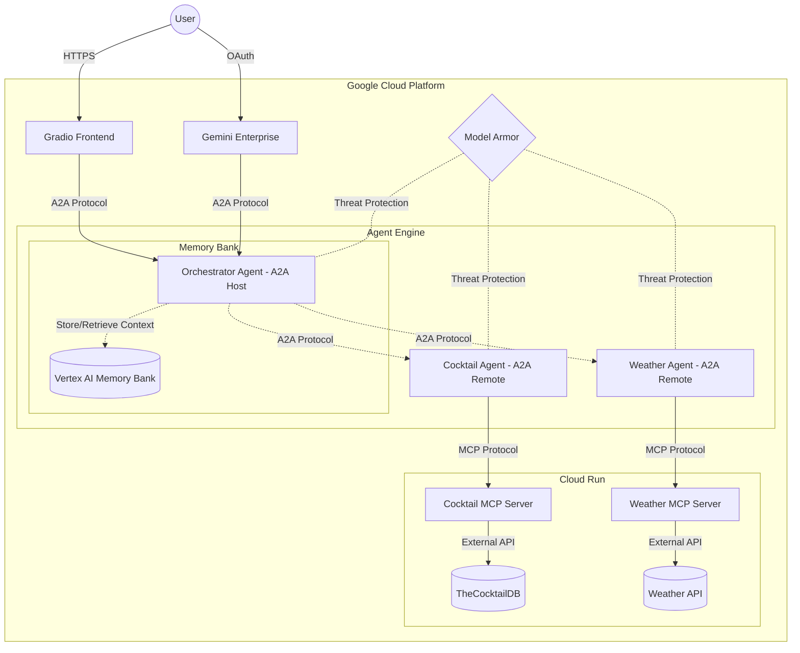

# A2A Multi-Agent with Memory Bank (adk-mb)

A multi-agent orchestration demo on Google Cloud using **Agent2Agent (A2A)**, **Agent Development Kit (ADK)**, and **Model Context Protocol (MCP)** — with persistent memory via **Vertex AI Memory Bank**.

A Host Agent coordinates tasks between specialized remote A2A agents (Cocktail, Weather) that call MCP servers to fulfill user requests, while conversation history is persisted across sessions.


<!-- toc -->

- [Key Features](#key-features)
- [Project Structure](#project-structure)
- [Prerequisites](#prerequisites)
- [Quick Start (Local)](#quick-start-local)
- [Manual Cloud Deployment](#manual-cloud-deployment)
- [CI/CD Pipeline](#cicd-pipeline)
- [Testing](#testing)
- [Observability](#observability)
- [Architecture Details](#architecture-details)
- [Additional Documentation](#additional-documentation)
- [Disclaimer](#disclaimer)
- [License](#license)

<!-- tocstop -->

## Key Features

- **Multi-Agent Orchestration** — Host agent delegates to specialist agents (Cocktail, Weather) via the A2A protocol
- **Memory Bank** — Conversation context persisted with Vertex AI Memory Bank (the "mb" in "adk-mb")
- **MCP Protocol** — Agents fetch data from remote MCP servers (TheCocktailDB, National Weather Service)
- **Model Armor** — Google Cloud Model Armor integration for LLM threat protection
- **Circuit Breaker** — Resilient external calls with automatic failure isolation
- **CI/CD Pipeline** — GitHub Actions + Terraform for automated deployments
- **Cloud Logging** — Structured logging across all components

## Project Structure

```
.
├── src/
│   ├── a2a_agents/
│   │   ├── common/                # Shared agent base classes and utilities
│   │   ├── hosting_agent/         # Orchestrator — routes tasks, manages memory
│   │   ├── cocktail_agent/        # Specialist — cocktail queries via MCP
│   │   └── weather_agent/         # Specialist — weather queries via MCP
│   ├── mcp_servers/
│   │   ├── cocktail_mcp_server/   # FastMCP server wrapping TheCocktailDB API
│   │   └── weather_mcp_server/    # FastMCP server wrapping NWS Weather API
│   └── frontend/                  # Gradio web interface
├── deployment/
│   ├── deploy_agents.py           # Deploys agents to Vertex AI Agent Engine
│   └── terraform/                 # Infrastructure as Code (Cloud Run, IAM, etc.)
├── tests/
│   ├── unit/                      # Unit tests
│   ├── integration/               # Integration tests (require deployed services)
│   ├── eval/                      # Agent evaluation tests
│   └── load_test/                 # Load / performance tests
├── docs/                          # Extended documentation
├── docker-compose.yml             # Local development stack
├── pyproject.toml                 # Python dependencies (managed with uv)
└── .env.example                   # Template for environment variables
```

## Prerequisites

| Tool | Version | Purpose |
|------|---------|---------|
| Python | >= 3.12 | Runtime |
| [uv](https://docs.astral.sh/uv/) | latest | Python package manager |
| [gcloud CLI](https://cloud.google.com/sdk/docs/install) | latest | Google Cloud SDK |
| [Terraform](https://developer.hashicorp.com/terraform/install) | >= 1.8.0 | Infrastructure provisioning (for cloud deployment) |
| Docker | latest | Local development via `docker compose` |

You also need a Google Cloud project with billing enabled and the following APIs active:

- Vertex AI API
- Cloud Run API
- Secret Manager API
- Cloud Build API

## Quick Start (Local)

The fastest way to run the frontend and MCP servers locally. Note: the agents themselves run on Vertex AI Agent Engine in the cloud, so you must deploy them first (see [Manual Cloud Deployment](#manual-cloud-deployment) or [CI/CD Pipeline](#cicd-pipeline)).

**1. Install dependencies**

```bash
uv sync
```

**2. Configure environment**

```bash
cp .env.example .env
# Edit .env — fill in PROJECT_ID, PROJECT_NUMBER, and AGENT_ENGINE_ID
```

**3. Authenticate with Google Cloud**

```bash
gcloud auth application-default login
```

**4. Start the local stack**

```bash
docker compose up --build
```

This starts:
| Service | URL | Description |
|---------|-----|-------------|
| Frontend | http://localhost:8080 | Gradio chat UI |
| Cocktail MCP | http://localhost:8081 | Cocktail MCP server |
| Weather MCP | http://localhost:8082 | Weather MCP server |

The frontend connects to your cloud-deployed Agent Engine (`AGENT_ENGINE_ID` in `.env`).

## Manual Cloud Deployment

If you prefer to deploy step-by-step from your terminal instead of using the CI/CD pipeline.

<details>
<summary><b>View Manual Deployment Steps</b></summary>

### 1. Deploy MCP Servers to Cloud Run

```bash
# Set your project
export PROJECT_ID=your-project-id
export GOOGLE_CLOUD_REGION=us-central1

# Deploy Cocktail MCP Server
cd src/mcp_servers/cocktail_mcp_server
gcloud builds submit --tag gcr.io/$PROJECT_ID/cocktail-remote-mcp-server-adk-mb
gcloud run deploy cocktail-remote-mcp-server-adk-mb \
  --image gcr.io/$PROJECT_ID/cocktail-remote-mcp-server-adk-mb \
  --region $GOOGLE_CLOUD_REGION --platform managed --allow-unauthenticated

# Deploy Weather MCP Server
cd ../weather_mcp_server
gcloud builds submit --tag gcr.io/$PROJECT_ID/weather-remote-mcp-server-adk-mb
gcloud run deploy weather-remote-mcp-server-adk-mb \
  --image gcr.io/$PROJECT_ID/weather-remote-mcp-server-adk-mb \
  --region $GOOGLE_CLOUD_REGION --platform managed --allow-unauthenticated
```

Note the generated Cloud Run URLs for both services.

### 2. Deploy A2A Agents to Agent Engine

Update your `.env` with the MCP server URLs (`CT_MCP_SERVER_URL`, `WEA_MCP_SERVER_URL`), then:

```bash
cd ../../..   # back to project root
uv sync --extra agent-engine
python deployment/deploy_agents.py
```

Save the `AGENT_ENGINE_ID` printed at the end — you need it for the frontend.

### 3. Deploy Frontend to Cloud Run

```bash
export AGENT_ENGINE_ID=<value-from-step-2>

cd src/frontend
gcloud builds submit --tag gcr.io/$PROJECT_ID/a2a-frontend-adk-mb
gcloud run deploy a2a-frontend-adk-mb \
  --image gcr.io/$PROJECT_ID/a2a-frontend-adk-mb \
  --region $GOOGLE_CLOUD_REGION \
  --set-env-vars="AGENT_ENGINE_ID=$AGENT_ENGINE_ID,PROJECT_ID=$PROJECT_ID,LOCATION=$GOOGLE_CLOUD_REGION" \
  --allow-unauthenticated
```

### 4. Secure the Services

Remove `--allow-unauthenticated` from your Cloud Run services and grant targeted IAM invoker roles to your service accounts to restrict access.

</details>

## CI/CD Pipeline

The recommended deployment path. Pushing to `staging` or `main` triggers a GitHub Actions workflow that:

1. **Detects changes** — only deploys components that changed (MCP servers, agents, frontend, infra)
2. **Builds container images** — pushes to GCR
3. **Applies Terraform** — provisions Cloud Run services, Agent Engine shells, IAM, Secret Manager, Model Armor
4. **Deploys agents** — runs `deploy_agents.py` to push agent code to Agent Engine
5. **Deploys frontend** — updates the Cloud Run frontend service
6. **Registers with Gemini Enterprise** — links agents for direct Gemini UI access

The pipeline uses a **Hybrid Provisioning** approach:
- **Terraform** creates infrastructure "shells" and uses `ignore_changes` on agent specs to prevent reverting SDK deployments.
- **Python SDK** (`deploy_agents.py`) fills the shells with actual agent code and dependencies.

For full setup instructions, see the **[CI/CD Setup Guide](docs/cicd-setup.md)**.

## Testing

> Requires Python 3.12+ and dev dependencies: `uv sync --extra dev`

```bash
# Unit tests
pytest tests/unit/ -v

# Unit + evaluation tests
pytest tests/unit/ tests/eval/ -v

# Lint and format check
ruff check .
ruff format --check .

# Integration tests (requires deployed services and env vars)
pytest tests/integration/ -m integration -v
```

See [Testing Summary](tests/TESTING_SUMMARY.md) for details on evaluation sets and load tests.

## Observability

| Component | Where to find logs |
|-----------|-------------------|
| Frontend | Cloud Run console → `a2a-frontend-adk-mb` |
| Agents | Vertex AI Agent Engine console |
| MCP Servers | Cloud Run console → `*-remote-mcp-server-adk-mb` |

All agent requests include `x-goog-user-project` headers for usage tracking.

## Architecture Details



## Additional Documentation

- [CI/CD Setup Guide](docs/cicd-setup.md) — Step-by-step CI/CD configuration
- [Software Design](docs/software_design.md) — Technical architecture and design decisions
- [WIF Authentication](docs/github-actions-wif-auth.md) — GitHub Actions ↔ GCP auth setup
- [Forked Repo CI/CD](docs/FORKED_REPO_CICD.md) — CI/CD setup for forked repositories
- [Testing Summary](tests/TESTING_SUMMARY.md) — Test structure, eval sets, and load tests

## Disclaimer

This project is an experimental demonstration built using Google open-source frameworks. It is not an officially supported Google product.

## License

This project is licensed under the [Apache 2.0 License](LICENSE).
