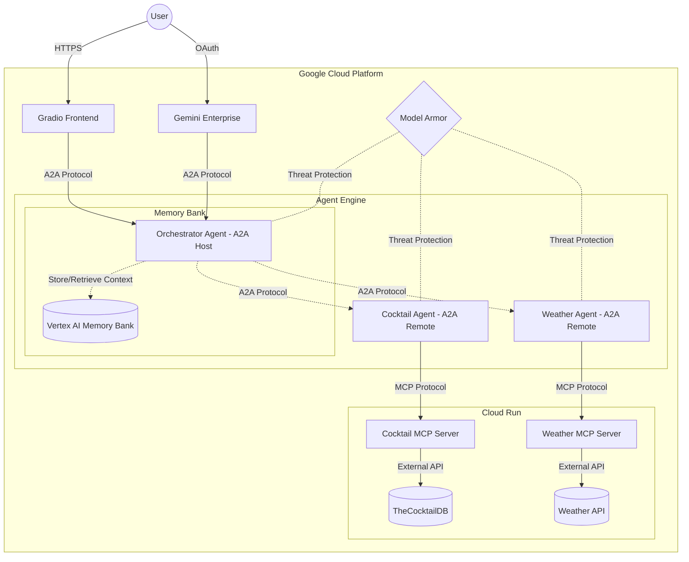

# A2A Multi-Agent with Memory Bank (adk-mb)

This web application demonstrates the integration of Google's open-source frameworks **Agent2Agent (A2A)** and **Agent Development Kit (ADK)** for multi-agent orchestration with **Model Context Protocol (MCP)** clients.

The application features a Host Agent coordinating tasks between specialized remote A2A agents (Cocktail, Weather) that interact with various MCP servers to fulfill user requests, seamlessly persisting conversation history using **Vertex AI Memory Bank**.

<!-- toc -->

- [Key Features](#key-features)
- [Architecture](#architecture)
  * [Core Components](#core-components)
- [Quickstart & Deployment](#quickstart--deployment)
  * [Automated CI/CD Setup (Recommended)](#automated-cicd-setup-recommended)
  * [Manual Deployment](#manual-deployment)
- [Observability & Monitoring](#observability--monitoring)
- [Testing & Quality Assurance](#testing--quality-assurance)
- [Additional Documentation](#additional-documentation)
- [Disclaimer](#disclaimer)
- [License](#license)

<!-- tocstop -->

## Key Features

- **Multi-Agent Orchestration**: Host agent delegates tasks to specialized agents (Cocktail, Weather)
- **Memory Bank Integration**: Conversation history persisted using Vertex AI Memory Bank (the "mb" in "adk-mb")
- **MCP Protocol**: Agents communicate with remote MCP servers for data retrieval
- **A2A Protocol**: Standardized agent-to-agent communication
- **Cloud Logging**: Integrated Google Cloud Logging for unified observability
- **CI/CD Pipeline**: Automated deployment using GitHub Actions and Terraform
- **Resiliency**: Custom Circuit Breaker for robust external communication
- **Reliability**: Automatic HTTP retry implementation for robust Gemini LLM calls
- **Threat Protection**: Google Cloud Model Armor integration for Vertex AI LLM calls

## Architecture


System Diagram:



### Core Components

1. **Frontend**: A Gradio web interface hosted on Cloud Run (Option A) or direct interaction via Gemini Enterprise UI (Option B).
2. **Orchestration (Host Agent)**: Central "brain" within Vertex AI Agent Engine that manages intent routing, memory persistence, and final response synthesis.
3. **Specialists**: A2A remote agents focused on specific scopes (Cocktail, Weather).
4. **Data Retrieval (MCP)**: Standardized server adapters translating agent requests into specific API calls.

## Quickstart & Deployment

We strongly recommend using the automated CI/CD pipeline for deploying this infrastructure.

### Automated CI/CD Setup (Recommended)

**Before you push**, complete the one-time setup:

| Step | What | Where |
|---|---|---|
| 1 | Fork/clone this repo to GitHub | GitHub |
| 2 | Create a GCP service account (`github-runner`) with required IAM roles | GCP Console / `gcloud` |
| 3 | Set up Workload Identity Federation (WIF) | GCP Console / `gcloud` |
| 4 | **Set GitHub Actions environment variables** (`PROJECT_ID`, `WORKLOAD_IDENTITY_PROVIDER`, etc.) | GitHub → Settings → Environments |

> ⚠️ Step 4 is the most commonly missed step. The pipeline will fail at authentication if these variables are not set.

Follow the **[CI/CD Setup Guide](docs/cicd-setup.md)** for full instructions and copy-paste commands.

The CI/CD pipeline employs an **App/Infra Divide** (Hybrid Provisioning) approach to prevent state drift and handle dynamic Python dependencies:
1. **Infrastructure (Terraform)** provisions all underlying resources and infrastructure "shells" (Service Accounts, Cloud Run services, empty Reasoning Engines) and explicitly ignores changes to deployment specs (`ignore_changes = [spec[0]]`).
2. **Application (Python SDKs)** (`deploy_agents.py`) dynamically bundle dependencies from `pyproject.toml` and deploy the actual application code and artifacts to the initialized infrastructure shells.
3. **Registration Scripts** use exponential backoff to handle Gemini Enterprise API's eventual consistency when creating or destroying linked authorizations.

Once configured, pushing to `staging` or `main` automatically triggers the pipeline — it detects which components changed and only deploys what's needed.

### Manual Deployment

If you prefer not to use CI/CD, you can deploy manually using our provided scripts.

<details>
<summary><b>View Manual Deployment Steps</b></summary>

**1. Deploy MCP Servers**

```bash
# Deploy Cocktail MCP Server
cd src/mcp_servers/cocktail_mcp_server
gcloud builds submit --tag gcr.io/$PROJECT_ID/cocktail-remote-mcp-server-adk-mb
gcloud run deploy cocktail-remote-mcp-server-adk-mb --image gcr.io/$PROJECT_ID/cocktail-remote-mcp-server-adk-mb --region $GOOGLE_CLOUD_REGION --platform managed --allow-unauthenticated

# Deploy Weather MCP Server
cd ../weather_mcp_server
gcloud builds submit --tag gcr.io/$PROJECT_ID/weather-remote-mcp-server-adk-mb
gcloud run deploy weather-remote-mcp-server-adk-mb --image gcr.io/$PROJECT_ID/weather-remote-mcp-server-adk-mb --region $GOOGLE_CLOUD_REGION --platform managed --allow-unauthenticated
```

_Note the generated URLs for both services._

**2. Deploy A2A Agents**
Update your local environment variables with the MCP URLs and your GCP Project settings, then run:

```bash
# Install agent-engine dependencies first
uv sync --extra agent-engine
python deployment/deploy_agents.py
```

_Save the generated Agent Engine ID at the end of the script for the frontend setup._

**3. Deploy Frontend**

```bash
cd src/frontend
gcloud builds submit --tag gcr.io/$PROJECT_ID/a2a-frontend-adk-mb
gcloud run deploy a2a-frontend-adk-mb --image gcr.io/$PROJECT_ID/a2a-frontend-adk-mb --region $GOOGLE_CLOUD_REGION --set-env-vars="AGENT_ENGINE_ID=$AGENT_ENGINE_ID,PROJECT_ID=$PROJECT_ID,LOCATION=$GOOGLE_CLOUD_REGION" --allow-unauthenticated
```

**4. Secure the Services**
Remove public access from your Cloud Run instances and grant tight IAM invoker permissions to your service accounts to prevent unauthorized access.

</details>

## Observability & Monitoring

The application leverages **Google Cloud Logging** to provide structured, centralized logging across all components.

- **Frontend Logs**: Access via Cloud Run console (`a2a-frontend-adk-mb`).
- **Agent Logs**: View Host, Cocktail, and Weather agent behaviors directly in the Vertex AI Agent Engine console.
- **Traceability**: All agent requests utilize `x-goog-user-project` headers for accurate usage tracking.

## Testing & Quality Assurance

We maintain rigorous testing standards across the application. For detailed instructions on running evaluations and load tests, refer to our [Testing Summary](tests/TESTING_SUMMARY.md).

> Requires Python 3.12+. Install dependencies with `uv sync --extra dev`.

```bash
# Run all unit tests
pytest tests/unit/ -v

# Run unit + non-integration tests (single command)
pytest tests/unit/ tests/eval/ -v

# Lint and format check
ruff check .
ruff format --check .

# Integration tests (require deployed services — set env vars first)
pytest tests/integration/ -m integration -v
```

## Additional Documentation

- 📘 [CI/CD Setup Guide](docs/cicd-setup.md)
- 📘 [Testing Summary](tests/TESTING_SUMMARY.md)
- 📘 [Software Design](docs/software_design.md)

## Disclaimer

This project is an experimental demonstration built using Google open-source frameworks. It is not an officially supported Google product.

## License

This project is licensed under the [License](LICENSE).
