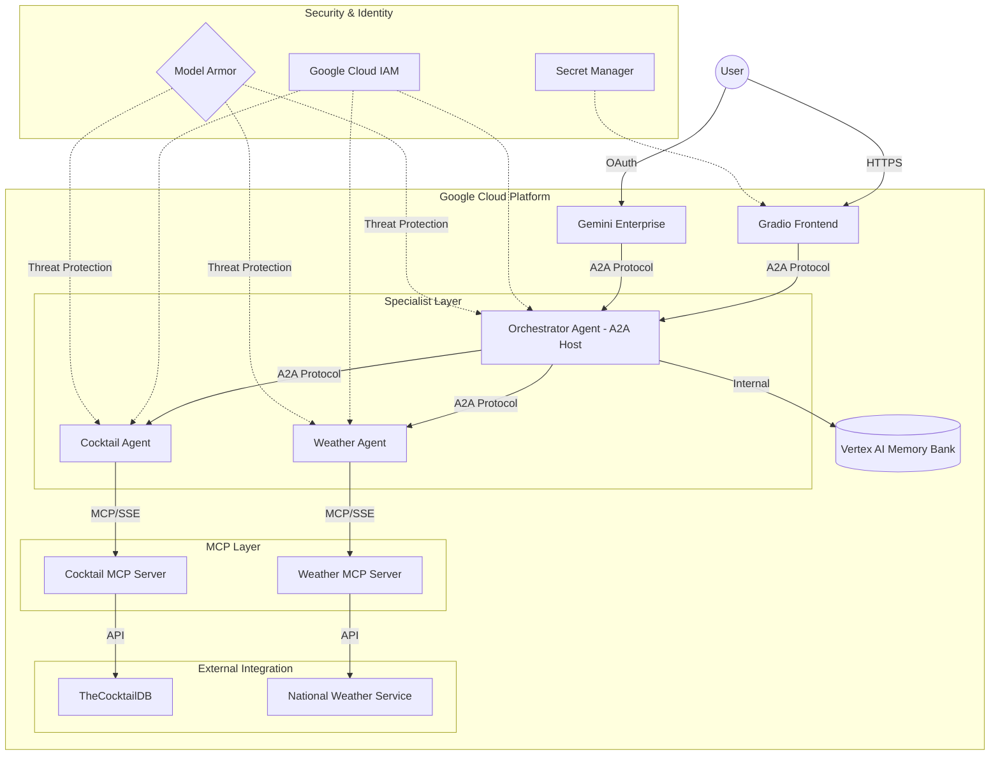

# Software Design Document: A2A Multi-Agent System with Memory Bank

## 1. Introduction

### 1.1 Purpose

The purpose of this document is to provide a comprehensive technical design for the A2A Multi-Agent system. This system leverages the Google Agent Development Kit (ADK), Agent-to-Agent (A2A) protocol, and Vertex AI Memory Bank to provide a persistent, multi-specialist AI assistant capable of handling weather and cocktail-related inquiries with long-term memory.

### 1.2 Scope

This document covers the architectural patterns, component design, data flow, security model, and deployment strategy for the entire ecosystem, including the frontend UI, orchestrator agent, specialist agents, and MCP servers.

## 2. System Overview

The system follows a **Host/Specialist Architecture** pattern.

- **The Host (Orchestrator)** acts as the primary interface for the user, decomposing complex requests and routing tasks to the appropriate specialist agents via the A2A protocol.
- **Specialist Agents** are fine-tuned for specific domains (Weather, Cocktails) and utilize the Model Context Protocol (MCP) to interact with external data sources.
- **Persistent Memory** is achieved through integration with the Vertex AI Memory Bank, which stores and retrieves semantic context across sessions.
- **Resource Management & Resiliency**: Efficient connection pooling, metadata caching, and an HTTP Circuit Breaker are implemented to minimize latency and prevent cascading failures.
- **Security & Threat Protection**: End-to-end security via IAM and Google Cloud Model Armor floor settings to proactively filter out malicious LLM prompts and responses.

## 3. Architectural Design

### 3.1 High-Level Architecture

The following diagram illustrates the system's core components and their interactions, highlighting the separation of concerns and the security boundary.

### 3.2 Technology Stack

| Component         | Technology                                         |
| :---------------- | :------------------------------------------------- |
| **Language**      | Python 3.12+, `aiobreaker` for resiliency          |
| **AI Framework**  | Google Agent Development Kit (ADK)                 |
| **Agent SDK**     | `a2a-sdk` for A2A protocol implementation          |
| **Protocols**     | A2A (Agent-to-Agent), MCP (Model Context Protocol) |
| **Communication** | SSE (Server-Sent Events) for MCP, JSON-RPC for A2A |
| **Compute**       | Google Cloud Run, Vertex AI Agent Engine           |
| **Storage**       | Vertex AI Memory Bank                              |
| **Security**      | IAM, WIF, Secret Manager, Cloud Model Armor        |
| **CI/CD**         | GitHub Actions, Terraform                          |
| **UI**            | Gradio                                             |
| **Package Mgr**   | `uv` with `pyproject.toml`                         |

## 4. Detailed Design

### 4.1 Orchestrator Agent (A2A Host)

Implemented in `AdkOrchestratorAgent`, the orchestrator serves as the central hub.

- **Task Decomposition**: Analyzes user intent and determines if a specialist is needed.
- **Routing**: Uses the `send_message` tool to delegate tasks to specialists.
- **Memory Integration**: Executes an `after_agent_callback` to save sessions to the Memory Bank.
- **Context Management**: Preloads relevant semantic memories using ADK integration before generating responses.

### 4.2 Specialist Agents

Each specialist (e.g., `CocktailAgent`, `WeatherAgent`) inherits from `AdkBaseMcpAgentExecutor`.

- **Domain Specificity**: Configured with specialized instructions and tools.
- **MCP Tooling**: Connects to remote MCP servers via environment-configured URLs (`CT_MCP_SERVER_URL`, `WEA_MCP_SERVER_URL`).
- **Autonomy**: Can resolve domain-specific tasks independently while reporting results back to the orchestrator.

### 4.3 MCP Servers

The MCP servers are built using `FastMCP` and exposed as Cloud Run services.

- **Cocktail Server**: Provides tools for searching recipes, ingredients, and random cocktails.
- **Weather Server**: Provides tools for city-based forecasts and active weather alerts.
- **Statelessness**: Servers are designed to be stateless, processing individual tool calls with minimal overhead.
- **Lifecycle Management**: Implemented using `FastMCP(lifespan=...)` to ensure `httpx.AsyncClient` is gracefully closed upon server shutdown.

### 4.4 Performance & Resiliency Optimization

The system employs several patterns to optimize throughput and reduce latency:

- **Connection Pooling & Circuit Breaker**: A shared `httpx.AsyncClient` is used across the frontend and orchestrator. This allows for persistent TCP connections to avoid frequent TLS handshakes. It is wrapped in a custom `aiobreaker` transport layer acting as a **Circuit Breaker**. This fails fast if downstream MCP servers are unresponsive, protecting the orchestrator from stalling.
- **Strict Timeouts**: The shared HTTP client uniformly enforces a 60-second timeout.
- **Metadata Caching**: The frontend implements a memory cache for the `agent_card` metadata retrieved from Vertex AI. This prevents multiple redundant network round-trips to the Vertex AI Control Plane for static agent definitions.
- **Async I/O Efficiency**: All network interactions (A2A, MCP, and external APIs) utilize non-blocking `asyncio` patterns, ensuring the host can handle multiple concurrent sessions without thread exhaustion.

### 4.5 Memory Bank Integration

Persistent context is managed through the Vertex AI Memory Bank.

- **Auto-Saving**: The `auto_save_session_to_memory_callback` extracts conversation events post-invocation and persists them.
- **Semantic Retrieval**: Future conversations trigger a search in the memory bank to "remind" the agent of user preferences or past interactions (e.g., "What was that drink I liked last week?").

## 5. Security Considerations

### 5.1 Zero-Trust Architecture

The system is designed with a **Zero-Trust** security posture, assuming no implicit trust between components.

- **Dynamic Secret Retrieval**: Sensitive configuration and API keys are never hardcoded; they are retrieved at runtime from **Google Cloud Secret Manager**.
- **Least Privilege IAM**: Every component (Frontend, Orchestrator, Specialists, MCP Servers) operates under a dedicated service account with the minimal set of IAM permissions (e.g., `roles/aiplatform.user` for agents, `roles/run.invoker` for internal service calls).
- **Identity-Based Auth**: All internal service-to-service communication is authenticated using Google OIDC tokens.
- **Automated Token Management**: Agents utilize a `TokenManager` to dynamically fetch and refresh identity tokens, eliminating the risk of long-lived or hardcoded Bearer tokens.
- **WIF Authentication**: The CI/CD pipeline uses Workload Identity Federation for secure, keyless authentication between GitHub Actions and Google Cloud.

### 5.2 Data Protection

- **Communication Security**: All agent-to-agent and agent-to-MCP communication is encrypted via HTTPS/TLS.
- **Access Control**: The Gradio frontend is restricted to authorized users via Cloud Run IAM configuration.
- **History Sanitization**: The Git repository has undergone a comprehensive history scrub to remove all legacy tokens and sensitive endpoints, ensuring that no historical data can be exploited.

### 5.3 LLM Threat Protection (Model Armor)

- **Floor Settings Layer**: Google Cloud Model Armor is provisioned universally at the project level as a Floor Setting.
- **Dynamic Filtering**: Vertex AI API requests are automatically filtered (`INSPECT_AND_BLOCK`).
- **Policy Scopes**: Includes blocking configurations for jailbreaks, Personal Identifiable Information (PII), malicious URIs, hate speech, dangerous content, sexually explicit references, and harassment. This acts directly inside Google's edge layer before hitting the core language model.

## 6. Observability and Logging

The system implements a centralized logging strategy to provide visibility across all components:

- **Python Native Interface**: All components utilize the standard Python `logging` module for generating log events.
- **Cloud Integration**: The `setup_cloud_logging` utility (in `logging_utils.py`) integrates the Python root logger with **Google Cloud Logging** (Stackdriver) using the `CloudLoggingHandler`.
- **Environment Aware**: Cloud Logging is automatically enabled only when the `PROJECT_ID` environment variable is detected, falling back to standard stdout/stderr logging for local development.
- **Structured Visibility**: Logs include component identifiers (e.g., agent names) as log identifiers, allowing for granular filtering in the Google Cloud Console.

## 7. Deployment Architecture

### 7.1 Infrastructure as Code (Terraform)

The environment utilizes an **App/Infra Divide** (Hybrid Provisioning) model, strictly separating infrastructure deployment from application code updates:

- `google_cloud_run_v2_service`: For hosting MCP servers and the frontend.
- `google_service_account`: Dedicated identities for each component.
- `google_project_service`: Automatic enablement of required APIs (e.g., `aiplatform.googleapis.com`).
- `google_vertex_ai_reasoning_engine`: Acts as an "infrastructure shell" for the agents. Terraform establishes the baseline identity, network, and naming properties, using `ignore_changes` on the deployment and source code `spec` to ensure it never reverts application code updates made by the Python SDK.

### 7.2 CI/CD Pipeline

GitHub Actions automates the lifecycle (`.github/workflows/deploy.yml`):

- **Change Detection**: Path-filter determines which components changed (MCP servers, agents, frontend, Terraform).
- **Build**: Containerizes Gradio frontend and MCP servers via `gcloud builds submit`.
- **Infrastructure (Shells)**: Terraform `apply` provisions the base Cloud Run environments and Agent Engine shells.
- **Agent Deploy (Application Logic)**: `deployment/deploy_agents.py` dynamically extracts dependencies from `pyproject.toml` and updates the Reasoning Engine schemas using the Vertex AI Python SDK.
- **Gemini Enterprise Integration**: A post-deployment Terraform `local-exec` provisioner registers the fully-deployed reasoning engines with Gemini Enterprise. It includes exponential backoff retry logic to safely handle eventually consistent API state during registration and deregistration (`terraform destroy`).
- **Secret Update**: Stores the Agent Engine ID in Secret Manager for the frontend to consume at startup.
- **Model Armor**: Enforces safety floor settings after each deployment.
- **Authentication**: Uses Workload Identity Federation (keyless) between GitHub Actions and Google Cloud.

## 8. Testing Strategy

The project employs a multi-tiered testing strategy:

1.  **Unit Tests**: Local validation of agent logic and tool functions (`pytest`).
2.  **Integration Tests**: Verifying communication between Orchestrator and Specialists.
3.  **Evaluation (Eval) Suite**: Uses Gemini to score agent performance based on accuracy and helpfulness metrics.
4.  **Load Testing**: Simulating concurrent users to ensure stability under stress (`locust`).

## 9. Appendices

- **Source Code**: [GitHub Repository](https://github.com/wadave/a2a-multiagent-adk-memory-cicd)
